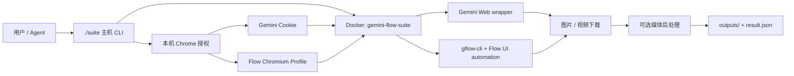

<p align="center">
  
</p>

<p align="center">
  <a href="https://github.com/Mr-funny/gemini-flow-suite/actions/workflows/ci.yml"></a>
  <a href="LICENSE"></a>
  
  
  
  
  
</p>

<p align="center">
  把 <strong>Gemini Web + Flow / Veo</strong> 的图片、视频能力装进同一个 Docker，<br />
  <strong>一次授权 · 一条 CLI · 统一下载 · 可选媒体后处理</strong>
</p>

> [!IMPORTANT]
> 这是非官方、基于网页会话和浏览器自动化的本地工具，不是 Google 官方 API，也不是传统 HTTP 反向代理。它把 Gemini Web 与 Flow 的生成入口统一代理到一条本地 CLI 中。请确认账号、地区、订阅和用途符合 Google 的现行条款。

## ⚡ 一句话交给 Agent 部署

把下面整段话发给 Codex、Claude Code，或其他能操作本机终端的 Agent：

```text
请从 https://github.com/Mr-funny/gemini-flow-suite 部署 Gemini Flow Suite。

检查 Docker、Docker Compose、Google Chrome/Chromium，复制 .env.example 为 .env，
提醒我设置新的 NOVNC_PASSWORD。启动后不要读取、打印或上传任何 Cookie、Chrome
Profile 或 Google 账号数据；只引导我分别执行 ./suite auth gemini 和 ./suite auth flow。
最后运行 ./suite status、测试和 Docker Compose 配置检查，并说明输出目录。
```

Agent 可以完成环境检查和容器部署；Gemini 与 Flow 登录必须由你在本机浏览器中完成。

## 🚀 核心卖点：把 Gemini Pro 用到极致

| 能力 | Gemini Web | Flow / Veo |
|---|:---:|:---:|
| 文生图 | ✅ | ✅ |
| 图生图 | 由对话支持 | ✅ |
| 文生视频 | ✅ | ✅ |
| 首帧 / 尾帧视频 | — | ✅ |
| 参考图视频 | — | ✅ |
| 原始命令透传 | — | ✅ |
| 自动下载与统一输出 | ✅ | ✅ |
| 可选可见标记与元数据后处理 | ✅ | ✅ |

真正省事的地方：

- **一次性封装两套入口**：Gemini Web 图片、视频和 Flow / Veo 图片、视频都由 `./suite` 调用。
- **完整 Docker 运行时**：Chromium、字体、FFmpeg、noVNC 和 Python 依赖全部封装。
- **授权留在本机**：Cookie 只导入 Docker volume，不写入仓库或命令参数。
- **适合批处理与 Agent**：可进入短视频、首尾帧连续生成和自动化工作流。
- **输出可审计**：文件统一落盘，并附带 `result.json`。
- **包含 Flow 兼容补丁**：已适配 2026 年 7 月 UI 选择器变化。

## 📦 三步部署

### 1. 准备环境

- Docker Desktop，或 Docker Engine + Compose v2。
- Google Chrome / Chromium。
- 可访问 Gemini 与 Flow 的网络环境。
- 具备对应 Gemini / Flow / Veo 权限和额度的 Google 账号。

当前固定构建 `linux/amd64`。Apple Silicon 可通过 Docker Desktop 架构模拟运行，首次构建会更慢。

### 2. 克隆并启动

```bash
git clone https://github.com/Mr-funny/gemini-flow-suite.git
cd gemini-flow-suite
cp .env.example .env

# 编辑 .env，至少修改 NOVNC_PASSWORD。
./suite up
```

```bash
./suite status
./suite logs
./suite down
./suite build
```

noVNC 仅绑定本机：<http://127.0.0.1:7900/vnc.html>

### 3. 完成两次授权

```bash
./suite auth gemini
./suite auth flow
./suite status
```

Gemini 使用 `Gemini-API` 所需的 Web Cookie；Flow 使用 `gflow-cli` 的独立 Chromium Profile。两者来自同一个本机登录会话，但运行时格式不同，因此要分别导入。授权保存在 Docker named volume `gemini-flow-suite-data`，不会写入 Git。

## 🎨 生成图片与视频

### Gemini Web

```bash
./suite gemini image \
  "A cinematic Hong Kong cha chaan teng at night" \
  --out-dir gemini/images/hong-kong

./suite gemini video \
  "A slow cinematic push-in through a rainy neon street" \
  --out-dir gemini/videos/neon-street
```

可附加 `--model MODEL`、`--keep-originals` 或 `--no-clean`。

### Flow 图片

```bash
./suite flow image t2i \
  "Editorial food photography of beef offal noodles" \
  --model nano-banana-2 --aspect 9:16 \
  --out flow/images/noodles

./suite flow image i2i \
  "Turn this photo into a premium menu advertisement" \
  --ref /workspace/reference.png \
  --model nano-banana-2 --out flow/images/menu
```

### Flow / Veo 视频

```bash
./suite flow video t2v \
  "A chef serves steaming beef offal noodles" \
  --model veo-quality --duration 4 --aspect 9:16 \
  --out-dir flow/videos/noodles

./suite flow video i2v \
  --initial-frame /workspace/start.png \
  --end-frame /workspace/end.png \
  "A smooth continuous camera move" \
  --model veo-quality --duration 4 \
  --out-dir flow/videos/transition
```

### Flow 原生命令透传

```bash
./suite flow raw models
./suite flow raw project list
./suite flow raw --help
```

> [!NOTE]
> Flow 参数、模型名和 UI 控件会随上游变化。若参数被当前账号或 UI 忽略，结果以 Flow 页面实际暴露的能力为准。

## 📁 输出与挂载

默认输出：

```text
outputs/
├── gemini/{images,videos}/
├── flow/{images,videos}/
└── .processing/
```

处理后文件名通常以 `_clean` 结尾，并写入 `result.json`。设置 `KEEP_ORIGINALS=true` 后，原文件保留在结果目录的 `.originals/`。

```dotenv
HOST_OUTPUT_DIR=/absolute/path/to/outputs
HOST_WORKSPACE_DIR=/absolute/path/to/your/project
```

| 主机路径 | 容器路径 | 权限 |
|---|---|---|
| `HOST_OUTPUT_DIR` | `/data/outputs` | 读写 |
| `HOST_WORKSPACE_DIR` | `/workspace` | 只读 |

## 🧠 工作原理



## ⚙️ 配置

```bash
cp .env.example .env
```

| 变量 | 默认值 | 说明 |
|---|---|---|
| `NOVNC_PASSWORD` | 必填 | noVNC 密码；不要使用示例值 |
| `NOVNC_PORT` | `7900` | 本机 noVNC 端口 |
| `FLOW_CDP_PORT` | `9223` | Flow Chrome 调试端口 |
| `GEMINI_CDP_PORT` | `9224` | Gemini Chrome 调试端口 |
| `HOST_PROXY` / `CONTAINER_PROXY` | 空 | 主机 / 容器代理 |
| `REMOVE_VISIBLE_WATERMARKS` | `true` | 启用可见标记与元数据后处理 |
| `KEEP_ORIGINALS` | `false` | 保留未处理原文件 |
| `IMAGE_CLEAN_BACKEND` | `migan` | 图片修复后端 |
| `GFLOW_CLI_PREFER_CLASSIC` | `true` | 优先经典 Flow 编辑模式 |
| `HOST_OUTPUT_DIR` | `./outputs` | 主机输出目录 |
| `HOST_WORKSPACE_DIR` | `.` | 只读参考素材目录 |

代理示例：

```dotenv
HOST_PROXY=http://127.0.0.1:10808
CONTAINER_PROXY=http://host.docker.internal:10808
```

## 🧹 可选媒体后处理

```bash
./suite clean image /workspace/input.png /data/outputs/manual/input_clean.png
./suite clean video /workspace/input.mp4 /data/outputs/manual/input_clean.mp4
```

后处理开关不是为了鼓励误导性发布。请保留必要的 AI 生成披露，并遵守平台条款、适用法律和发布渠道规则。

当前链路针对已知 Gemini 图片 sparkle / diamond、Gemini / Veo 视频中的小型可见文字或 diamond，以及常见 C2PA、EXIF、IPTC 和容器元数据。项目**不宣称**可以稳定移除像素级 SynthID，也不保证在动态背景、UI 更新或新标记样式下始终成功；正式发布前必须人工检查。

## ✅ 已验证环境

2026-07-24 本地验证：

- 容器健康运行，Gemini 与 Flow 两套持久化授权可用。
- Gemini 图片与视频生成、下载和可选后处理完成。
- Flow Nano Banana 2 图片生成、下载和可选后处理完成。
- Flow Veo 3.1 Lite 视频生成、下载和可选后处理完成。
- Flow 首帧 / 尾帧视频入口已适配 2026 年 7 月 UI。

Google 页面、模型名、额度策略和上游 CLI 都可能变化；“曾验证”不等于永久兼容。

## 🗂️ 项目结构

```text
gemini-flow-suite/
├── docs/showcase/hero.png
├── vendor/Gemini-API/
├── tests/
├── Dockerfile
├── compose.yaml
├── suite
├── suite_cli.py
├── run_gemini.py
├── sync_auth.py
├── sitecustomize.py
└── media_cleanup.py
```

## 🔐 安全与隐私

- `.env`、`outputs/`、Cookie、Chrome Profile、缓存和临时文件不会进入 Git。
- 登录发生在本机独立 Chrome Profile；Cookie 只导入 Docker named volume。
- noVNC 默认只监听 `127.0.0.1`，不要改成公网监听。
- 不要分享 `gemini-flow-suite-data`、`~/.gemini-flow-suite` 或浏览器 Profile。
- CI 会检查常见密钥格式和禁止追踪的授权文件名。

漏洞报告方式见 [SECURITY.md](SECURITY.md)。

## ⚠️ 限制与免责声明

- 非官方网页自动化项目，Google UI 变化可能随时导致功能失效。
- 账号订阅、地区、模型权限、生成额度和并发限制仍由 Google 决定。
- 项目不会绕过付费、额度、地区或账号权限。
- 不建议在多人共享服务器或公网无隔离环境中运行。
- Google、Gemini、Flow、Veo 为其各自权利人的商标；本项目与 Google 无隶属、赞助或认可关系。
- 你需要自行确认生成、自动化、后处理和发布方式符合相关条款与法律。

## 🧩 第三方项目

- [HanaokaYuzu/Gemini-API](https://github.com/HanaokaYuzu/Gemini-API) — AGPL-3.0，源码快照位于 `vendor/`。
- [ffroliva/gflow-cli](https://github.com/ffroliva/gflow-cli) — MIT。
- [wiltodelta/remove-ai-watermarks](https://github.com/wiltodelta/remove-ai-watermarks) — Apache-2.0。
- [allenk/VeoWatermarkRemover](https://github.com/allenk/VeoWatermarkRemover) — 构建时下载指定 release binary；上游当前未声明 SPDX 许可证，再分发镜像前请复核。

完整说明见 [THIRD_PARTY_NOTICES.md](THIRD_PARTY_NOTICES.md)。

## 🤝 贡献

欢迎提交兼容性修复、选择器更新、文档和测试。请阅读 [CONTRIBUTING.md](CONTRIBUTING.md)，不要在 Issue、日志或测试夹具中提交真实 Cookie、账号信息和生成历史。

## 📄 License

本仓库整体使用 [GNU Affero General Public License v3.0](LICENSE)，因为仓库直接包含并集成了 AGPL-3.0 的 Gemini-API 源码。第三方组件仍保留各自许可证。
